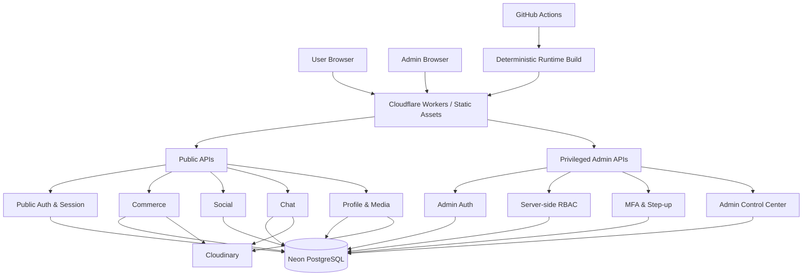

# Pasar UMKM

**Platform social-commerce untuk UMKM lokal, dibangun untuk menyatukan discovery, katalog, transaksi, interaksi sosial, komunikasi pelanggan, dan pengelolaan usaha dalam satu pengalaman digital.**

Pasar UMKM dikembangkan sebagai produk digital yang membantu pelaku UMKM membangun kehadiran online, menjangkau pelanggan, mengelola produk dan pesanan, serta berinteraksi melalui fitur sosial dan chat tanpa memisahkan pengalaman marketplace dari komunitas.

**Production:** https://pasar-umkm.hipmiptuinalazhaar.workers.dev/

---

## Status Produk

| Area | Status |
| --- | --- |
| Marketplace & katalog | Implemented |
| Cart, checkout & order lifecycle | Implemented |
| Seller center & product management | Implemented |
| Social profile, post, story & reels | Implemented |
| Notification & engagement | Implemented |
| Chat & media messaging | Implemented |
| Admin Control Center | Implemented |
| RBAC, MFA & step-up security | Implemented |
| Responsive mobile/tablet/desktop | Implemented |
| Runtime performance & lazy loading | Implemented |
| CI/CD & production deployment | Active |
| Production hardening & observability | Ongoing |

Pasar UMKM sudah berjalan di production dan saat ini berada pada fase **production hardening**: regression coverage, smoke testing end-to-end, observability, dokumentasi operasional, dan penyempurnaan edge case.

---

## Visi

Membangun ekosistem digital yang membantu UMKM berkembang, berinovasi, memperluas pasar, membangun hubungan dengan pelanggan, dan menjalankan aktivitas perdagangan melalui platform yang sederhana, aman, cepat, dan relevan dengan perilaku pengguna modern.

---

## Masalah yang Diselesaikan

Pelaku UMKM sering harus membagi aktivitas digitalnya ke banyak tempat: katalog di satu platform, promosi di media sosial, komunikasi di aplikasi chat, pencatatan pesanan secara manual, dan pengelolaan usaha di alat lain.

Pasar UMKM dirancang untuk mengurangi fragmentasi tersebut dengan satu alur terpadu:

**Discover → Follow → Interact → Chat → Shop → Checkout → Order → Review → Return**

Produk tidak diposisikan hanya sebagai direktori toko, tetapi sebagai fondasi **hybrid social-commerce** untuk UMKM lokal.

---

## Fitur Utama

### Marketplace & Discovery

- Direktori UMKM
- Katalog produk
- Pencarian dan discovery
- Profil toko
- Detail produk
- Kategori produk
- Incremental catalog loading
- Cursor/keyset pagination
- Favorite dan saved-item foundation

### Commerce

- Cart
- Checkout
- Buyer orders
- Seller orders
- Order detail
- Order status lifecycle
- Cancellation dan controlled restock
- Seller center
- Product management
- Product editor
- Product image upload
- Store onboarding
- Rating dan review

### Social Commerce

- Universal user profile
- Seller/social profile integration
- Post feed
- Like dan comment
- Follow system
- Story
- Reels
- Social notifications
- Media-focused presentation
- Commerce entry points dari surface sosial

### Chat

- Conversation list
- Conversation thread
- Direct messaging
- Rich-message metadata
- Mark-as-read
- Media upload
- Media cleanup
- Deterministic recent-message window
- Single active render ownership untuk menghindari duplicate controller

### Profile & Media

- User profile
- Profile editing
- Avatar upload
- External media storage
- Cloud media ownership validation
- Replacement cleanup
- Legacy profile-media fallback

### Admin Control Center

- Dedicated admin identity domain
- Dashboard/control center
- User inspection dan lifecycle control
- Store verification
- Store suspend/reactivate
- Product moderation controls
- Post moderation controls
- Admin session management
- Security event visibility
- Audit log

---

## Arsitektur Sistem



### Prinsip Arsitektur

- Public identity dan privileged admin identity dipisahkan.
- Browser tidak menjadi sumber kebenaran untuk permission.
- Database menjadi authority untuk role, permission, session state, dan transactional integrity.
- Runtime tidak melakukan schema DDL.
- Schema change dimiliki migration terkontrol.
- Feature asset yang tidak kritis di-load berdasarkan intent/route.
- Legacy controller dipensiunkan ketika owner baru aktif.
- Performance diperlakukan sebagai bagian dari design system, bukan pekerjaan tambahan setelah fitur selesai.

---

## Tech Stack

| Layer | Teknologi |
| --- | --- |
| Frontend | HTML, CSS, JavaScript |
| Runtime | Cloudflare Workers |
| Database | Neon PostgreSQL |
| PostgreSQL client | `@neondatabase/serverless` |
| Media storage | Cloudinary |
| Build runtime | Node.js 22 + esbuild |
| CI | GitHub Actions |
| Deployment | Cloudflare Git integration / Workers build |
| Version control | Git + GitHub |

Project sengaja mempertahankan frontend ringan tanpa framework besar. Kompleksitas dipisahkan melalui modular controller, route-loaded assets, API ownership, dan validation workflows.

---

## Commerce & Data Integrity

Commerce tidak hanya mengandalkan perubahan state di browser.

Backend menerapkan prinsip integritas seperti:

- atomic checkout transaction
- `BEGIN / COMMIT / ROLLBACK`
- row locking pada flow sensitif
- stock guard sebelum decrement
- idempotent order-status behavior
- cancellation dan restock dalam transactional boundary
- notification write di dalam lifecycle yang terkontrol
- keyset pagination untuk katalog
- deterministic ordering dengan tie-breaker ID

Tujuannya sederhana: retry, concurrency, dan keterlambatan jaringan tidak boleh mengubah satu pembelian menjadi eksperimen probabilitas.

---

## Security Architecture

### Public dan Admin Dipisahkan

Public marketplace account dan internal administrator account tidak berbagi identity boundary yang sama.

Privileged admin access memiliki:

- dedicated admin account/session domain
- server-authoritative RBAC
- explicit permission mapping
- no Super Admin code bypass
- TOTP MFA
- single-use recovery codes
- step-up authentication untuk permission sensitif
- session revocation
- security-version invalidation
- bounded session lifetime
- audit events

### Session Security

Privileged session menerapkan antara lain:

- high-entropy session tokens
- token hash persistence, bukan raw token
- secure HTTP-only cookie policy
- idle timeout
- absolute expiration
- session revocation
- account-level security-version checks
- hashed risk signals untuk audit

### Audit Discipline

Audit metadata tidak boleh menyimpan:

- password
- raw session token
- MFA secret
- recovery code
- sensitive credential material

### Authorization

Permission menggunakan stable `resource.action` keys dan di-resolve server-side pada request time.

UI boleh menyembunyikan tombol berdasarkan capability, tetapi backend tetap menjadi authority terakhir.

---

## Performance Architecture

Pasar UMKM menggunakan performance budget dan delivery discipline sebagai kontrak produk.

Beberapa prinsip yang sudah diterapkan:

- mobile-first critical path
- route/intent-based lazy loading
- bounded initial first-party requests
- source-size budgets untuk critical modules
- incremental catalog loading
- keyset pagination
- deterministic runtime build
- cache-boundary versioning
- legacy asset retirement
- reduced-motion support
- responsive breakpoint untuk mobile, tablet, dan desktop
- dedicated desktop cascade ownership

UI tidak boleh menjadi "premium" hanya karena menambahkan gradient, blur, dan tiga kilogram JavaScript.

---

## Responsive & Accessibility

Design system mengutamakan penggunaan nyata pada perangkat yang umum dipakai pelaku UMKM dan pelanggan.

Kontrak utama:

- mobile-first dari 360px
- responsive progression 360 → 390 → 430 → tablet → desktop
- touch target minimum 44px
- commerce/action target utama 48px bila relevan
- mobile form input yang aman dari accidental browser zoom
- reduced-motion handling
- restrained visual system
- informasi, hierarchy, dan affordance lebih penting daripada dekorasi

---

## 20 Engineering Rules

Project ini dikembangkan dengan aturan tetap berikut:

1. **Mobile-first**: mulai dari 360px sebelum memperluas ke layar besar.
2. **Premium but restrained**: hierarchy, spacing, typography, dan interaction lebih penting daripada dekorasi berlebihan.
3. **Anti-AI-slop**: tidak menerima UI generik, copy kosong, atau komponen tanpa tujuan produk.
4. **Own identity**: mengambil standar kualitas produk besar tanpa menyalin identitas visual mereka.
5. **One design system**: token, spacing, typography, state, dan interaction harus konsisten.
6. **Accessibility baseline**: touch target, input size, reduced motion, contrast, dan keyboard behavior diperlakukan sebagai requirement.
7. **Complete interaction states**: Idle → Pressed → Loading → Success/Error.
8. **Bottom sheet only for quick actions**: full form memakai dedicated page/workspace.
9. **One feature, one owner**: hindari duplicate controller, renderer, dan competing stylesheet ownership.
10. **Consolidate legacy**: owner baru harus memensiunkan legacy path yang sudah tidak diperlukan.
11. **Performance is design**: lazy-loading, request budget, payload budget, dan perceived speed termasuk kualitas UX.
12. **Preserve correct contracts**: backend/API/database yang sudah benar tidak diubah hanya demi kosmetik frontend.
13. **Version cache boundaries**: perubahan runtime penting harus memiliki cache-busting contract yang jelas.
14. **CI as permanent guardrail**: regression penting harus menjadi automated validation, bukan catatan ingatan manusia.
15. **Never game CI**: validation diperbaiki untuk menangkap bug nyata, bukan dibuat longgar agar lampu hijau.
16. **Release discipline**: branch → commit → PR → validation → explicit merge.
17. **Verify ownership and runtime**: route, API, lazy-loading, cache, build, dan render ownership harus diperiksa sebelum release.
18. **Scope discipline**: satu perubahan tidak boleh menyebar ke area yang tidak diperlukan.
19. **Build for scale**: pagination, transaction, storage ownership, dan modular boundaries dipikirkan sebelum data menjadi besar.
20. **Decision filter**: Premium, Simple, Mobile-first, Consistent, Fast, Accessible, Functional, Scalable, Anti-AI-Slop.

---

## Database & Migration Policy

Database production menggunakan migration ledger terkontrol.

Prinsip utama:

- tidak ada runtime `CREATE / ALTER / DROP` untuk schema object
- schema migration disimpan sebagai migration terpisah
- migration sensitif diuji pada temporary Neon branch sebelum production apply
- production apply membutuhkan validasi dan approval
- migration dependency dijalankan berurutan
- application code tidak boleh mengasumsikan schema baru sudah tersedia sebelum migration selesai

Ini menjaga database agar tidak ikut "berimprovisasi" setiap kali sebuah request masuk.

---

## CI/CD

Repository menggunakan GitHub Actions sebagai guardrail permanen.

Validation mencakup area seperti:

- runtime assets
- supply chain
- frontend phase contracts
- commerce ownership
- social ownership
- chat ownership
- responsive system
- performance budget
- admin bootstrap
- admin authentication
- RBAC
- Admin Control Center
- MFA/security
- final runtime bundle

Production deployment dilakukan melalui Cloudflare integration setelah perubahan yang disetujui masuk ke `main`.

Database migration tidak diperlakukan sebagai efek samping otomatis dari deployment aplikasi.

---

## Development & Build

### Requirement

- Node.js `>=22 <23`
- npm

### Install dependencies

```bash
npm ci --no-audit --no-fund
```

### Build deterministic runtime assets

```bash
npm run build:runtime
```

Repository saat ini belum mendefinisikan canonical `npm run dev` workflow. Dokumentasi tidak mengarang command lokal yang belum menjadi kontrak project.

Untuk perubahan production, gunakan branch dan PR agar seluruh validation workflow dapat berjalan sebelum merge.

---

## Repository Structure

```text
pasar-umkm/
├── admin/                 # Admin entry surface
├── assets/                # Brand and static assets
├── css/                   # Design system and feature presentation
├── database/
│   └── migrations/        # Controlled PostgreSQL migrations
├── docs/                  # Architecture and security documentation
├── js/                    # Frontend controllers and feature modules
├── scripts/               # Build and validation tooling
├── src/                   # Cloudflare Worker / server-side source
├── .github/workflows/     # CI and regression guardrails
├── index.html             # Public application shell
├── _headers               # Runtime/security/cache headers
├── package.json
└── README.md
```

---

## Technical Documentation

Admin architecture:

- [`docs/ADMIN_FOUNDATION.md`](docs/ADMIN_FOUNDATION.md)
- [`docs/ADMIN_BOOTSTRAP.md`](docs/ADMIN_BOOTSTRAP.md)
- [`docs/ADMIN_AUTH_SECURITY.md`](docs/ADMIN_AUTH_SECURITY.md)
- [`docs/ADMIN_RBAC.md`](docs/ADMIN_RBAC.md)
- [`docs/ADMIN_CONTROL_CENTER.md`](docs/ADMIN_CONTROL_CENTER.md)

Platform hardening:

- [`docs/P4_FINAL_AUDIT.md`](docs/P4_FINAL_AUDIT.md) — historical audit snapshot; beberapa rollout gate pada dokumen tersebut sudah diselesaikan setelah tanggal audit.

---

## Release Discipline

Perubahan production mengikuti pola:

```text
branch
  ↓
commit
  ↓
pull request
  ↓
automated validation
  ↓
review / verification
  ↓
explicit merge
  ↓
production deployment
  ↓
production verification
```

Untuk migration database, ada satu lapisan tambahan: temporary-branch verification sebelum apply ke production.

---

## Current Product Direction

Fokus Pasar UMKM bukan menambah fitur sebanyak mungkin.

Prioritas pengembangan adalah:

1. reliability pada flow yang sudah ada
2. end-to-end production smoke testing
3. security dan auditability
4. observability dan error diagnosis
5. UX consistency lintas commerce, social, chat, dan admin
6. performance pada perangkat dan jaringan nyata
7. kesiapan scale untuk lebih banyak toko, produk, order, dan interaksi

Setiap fitur baru harus membuktikan bahwa ia memperkuat marketplace, hubungan pelanggan, atau operasional UMKM. Fitur yang hanya terlihat menarik di screenshot tetapi tidak meningkatkan produk bukan prioritas.

---

## Founder & Initiative

**Founder**  
Capryan Agusto

**Initiated by**  
HIPMI PT UIN Al Azhaar Lubuklinggau

Pasar UMKM dibangun sebagai inisiatif digital untuk membantu UMKM lokal memperoleh akses yang lebih baik terhadap teknologi, pasar, jaringan, dan pengalaman perdagangan digital yang lebih modern.

---

© 2026 Pasar UMKM. All rights reserved.
