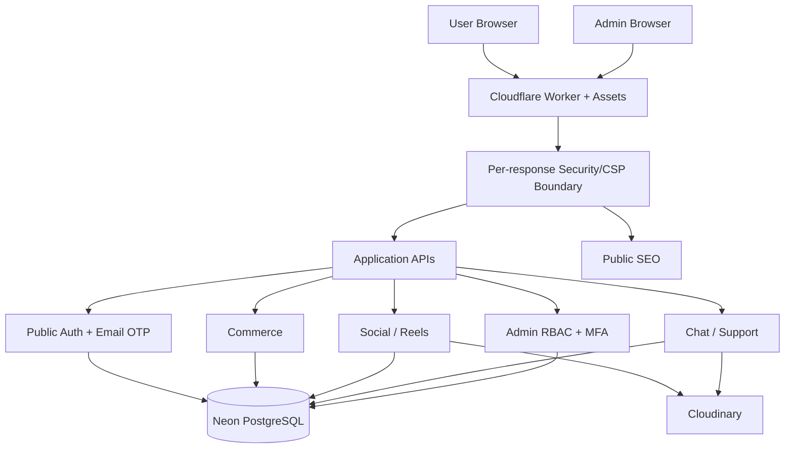

# Pasar UMKM

Platform social-commerce untuk UMKM lokal Lubuklinggau yang menyatukan discovery, katalog, transaksi, social surfaces, chat, dukungan pelanggan, dan pengelolaan usaha.

**Production:** `https://pasar-umkm.hipmiptuinalazhaar.workers.dev/`

## Status Produk

| Area | Status |
| --- | --- |
| Marketplace & katalog | Implemented |
| Cart, checkout & order lifecycle | Implemented |
| Seller center & product management | Implemented |
| Social profile, post, story & Reels | Implemented |
| Notification, chat & engagement | Implemented |
| Customer Support | Implemented |
| Admin Control Center | Implemented |
| RBAC, MFA & step-up security | Implemented |
| Email OTP registration & recovery | Implemented |
| SEO server-side | Implemented |
| Production observability | Implemented |
| Local release validation | Active |
| Production hardening | Ongoing |

## Arsitektur



Cloudflare entrypoint produksi adalah `src/security-worker-entry.js`. Entry ini membungkus SEO/application worker dengan CSP nonce acak per respons HTML. API response melewati `src/observability.js`, yang menambahkan request correlation/security headers dan mensterilkan seluruh respons API 5xx agar detail internal database/provider tidak bocor ke browser.

## Security

Prinsip utama:

- registrasi tidak membuat akun sebelum OTP email berhasil diverifikasi;
- password recovery menggunakan OTP email dan reset token sekali pakai;
- public session disimpan sebagai hash token di PostgreSQL;
- admin identity terpisah dari public identity;
- admin memakai RBAC, TOTP MFA, recovery code, step-up authentication, session revocation, dan audit log;
- privileged authorization selalu server-side;
- state-changing request dilindungi same-origin checks dan rate limiting;
- upload gambar/video memvalidasi format dan signature file pada boundary yang relevan;
- Cloudinary asset Reels dibersihkan jika upload berhasil tetapi validasi/DB write berikutnya gagal;
- event transaksi tidak dipercaya hanya karena browser mengirim event analytics;
- expired public/admin auth state dibersihkan secara bounded oleh runtime maintenance;
- API 5xx disanitasi pada global response boundary.

Lihat [`SECURITY.md`](SECURITY.md).

## Commerce & Data Integrity

Commerce menggunakan server-authoritative pricing/stock dan transaction boundary untuk flow sensitif. Checkout/order menerapkan row locking, stock guard, idempotent status transition, controlled restock, dan deterministic ownership.

Checkout preference multi-toko divalidasi dan disimpan secara atomic. Bila satu preference tidak valid, seluruh request di-rollback.

## Reels Commerce V4

Reels V4 memiliki canonical routing melalui `src/media-social-api.js`. Create/draft ditangani lebih dulu oleh `src/reels-v4-secure-create-api.js`, sebelum general V4 handler.

Secure create boundary menerapkan:

- authentication dan upload rate limit;
- magic-signature/container validation;
- maksimal 45 MB dan 180 detik;
- product ownership validation;
- trim validation;
- Cloudinary signed upload;
- automatic orphan cleanup;
- generic provider errors ke client.

Browser tidak boleh mengirim `event_type: order` sebagai bukti transaksi. Nilai transaksi harus berasal dari lifecycle server.

## Database & Migration

Database: Neon PostgreSQL.

Migration production berada di repository dan dicatat oleh `schema_migrations`. Runtime tidak boleh membuat atau mengubah schema sebagai efek samping request normal.

Untuk schema change baru:

1. siapkan migration;
2. uji di Neon temporary branch;
3. cross-check aplikasi terhadap schema baru;
4. minta approval sebelum apply production;
5. gunakan forward-fix jika migration production perlu dikoreksi.

## Development

Requirement:

- Node.js `>=22 <23`
- npm

Install:

```bash
npm ci --no-audit --no-fund
```

Build runtime:

```bash
npm run build:runtime
```

Canonical validation:

```bash
npm run validate
```

Validation mencakup lint syntax, Orders V2, Auth Security V2, route ownership, CSP/server-error boundary, phase contracts, commerce, performance, Reels, legal/trust, support, staging safety, dan P10 final completion.

## Release Process

GitHub Actions **tidak digunakan sebagai active release runner**. Folder `.github/workflows-disabled/` adalah arsip historis, bukan kontrol deployment.

Pre-deploy:

```bash
npm ci
npm run release:predeploy
```

Setelah semua gate lulus, Cloudflare Build & Deploy harus mengambil **commit `main` yang sama persis** dengan commit yang diverifikasi.

Post-deploy:

```bash
npm run release:postdeploy
```

Stateful authenticated E2E hanya boleh dijalankan terhadap staging yang terisolasi. Production probe harus non-destruktif.

Dokumentasi lengkap: [`docs/LOCAL_RELEASE_PROCESS.md`](docs/LOCAL_RELEASE_PROCESS.md).

## Repository Structure

```text
pasar-umkm/
├── admin/                     # Admin surfaces
├── assets/                    # Brand/static assets
├── checkout/                  # Checkout surface
├── css/                       # Design and feature styles
├── database/
│   ├── migrations/            # Canonical controlled migrations
│   └── staging/               # Isolated E2E seed/safety
├── docs/                      # Architecture/security/runbooks
├── js/                        # Browser controllers
├── migrations/                # Historical/application migrations still referenced by existing validators
├── scripts/                   # Build, validation, smoke, probes
├── src/                       # Cloudflare Worker/API source
├── _headers                   # Static asset fallback headers
├── index.html                 # Public application shell
├── package.json
└── wrangler.jsonc
```

## Engineering Rules

1. Mobile-first dan accessibility adalah requirement, bukan dekorasi akhir.
2. Browser bukan sumber kebenaran untuk permission, harga, stok, atau transaksi.
3. Satu route memiliki satu canonical owner; legacy path tidak boleh shadow owner baru.
4. Perubahan state sensitif harus transactional bila partial write dapat menciptakan state invalid.
5. Error internal tidak dikirim mentah ke client.
6. Secret tidak disimpan di repository.
7. Stateful test tidak menyentuh production.
8. Security regression harus punya validator permanen.
9. Build/deploy tidak dianggap berhasil sebelum post-deploy verification selesai.
10. Fitur baru tidak boleh mengorbankan reliability dari flow inti.

## Founder & Initiative

**Founder:** Capryan Agusto  
**Initiated by:** HIPMI PT UIN Al Azhaar Lubuklinggau

© 2026 Pasar UMKM. All rights reserved.
